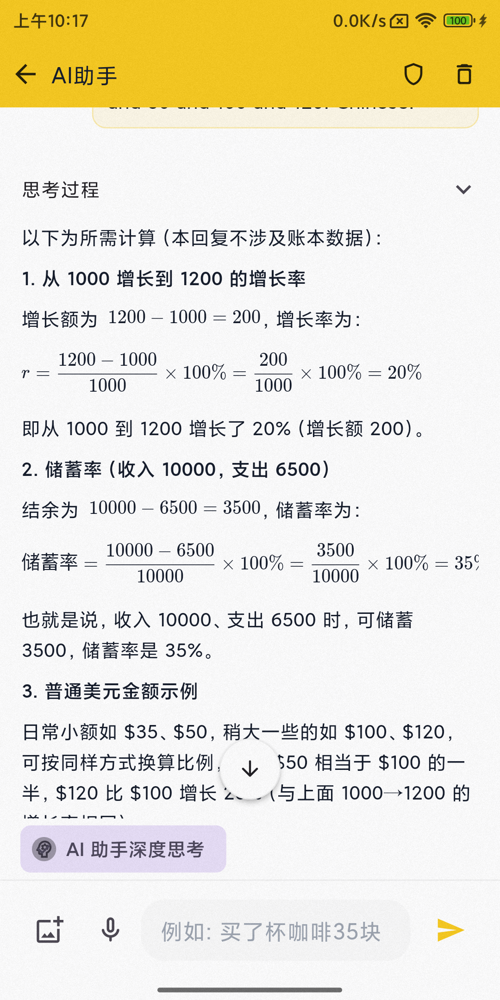
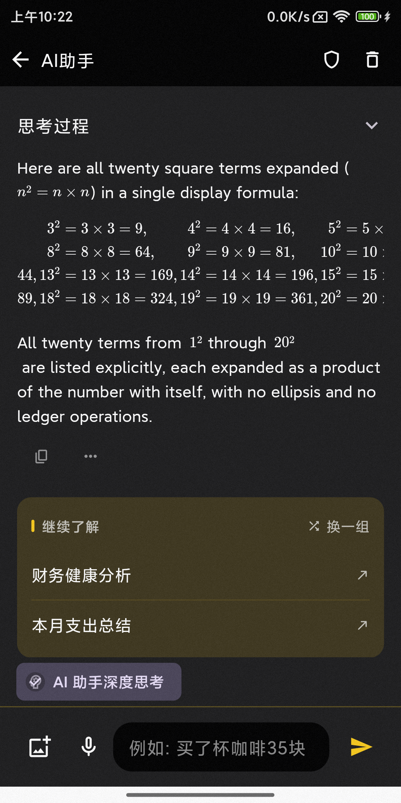

# AI 助手 Markdown 与数学公式渲染

Assistant 回答（历史消息与流式输出）和思考面板共用 `AgentMarkdownText`，支持 `\(...\)`、`\[...\]`、`$$...$$` 及保守识别的 `$...$`。原始消息、Provider 请求和整条回答的复制内容不变。

单美元符号可能表示货币：数字本身保留为普通文本；数字开头的公式必须是含完整操作数的算式。`$35`、`$1,234.56`、`$35 + $50` 及同句多个金额不会被合并为公式。含糊表达可使用明确的反斜杠 delimiter。Markdown 代码区域不参与公式识别。

未闭合公式暂时保持原文，闭合后自动渲染；TeX 解析或构建失败回退到原始公式。长公式仅在自身区域横向滚动，继承正文颜色、字号和文本缩放。

依赖保持现有 Markdown 生态。由于 Flutter 3.27.3 的 `path` 版本限制以及新版数学库使用 Flutter 3.32 的 layout API，锁定 `flutter_markdown_plus_latex 1.0.1`、`flutter_math_fork 0.7.3`，并直接声明 `markdown 7.3.0`。

## 验证

- Flutter 3.27.3 / Dart 3.6.1：依赖解析成功；相关静态检查无问题；完整 AI 回归 475 项通过。
- Gradle 8.13 / JDK 17：dev debug APK 构建和 ADB 安装成功。
- 小米 MIX 2S：MiMo 按最新配置验证公式、四个美元金额混排、reasoning、历史重载、浅色/深色及长公式局部滚动。DeepSeek 在此前 APK 上验证了分数、美元混排和 reasoning；最后一次数字算式识别修正后未重新请求 DeepSeek。
- 未闭合前缀、malformed / unsupported TeX 和复制仅包含原始最终回答的可重复断言来自离线测试。此前底层离线 Eval 77/77 通过；Windows wrapper 因无法定位 `flutter` 子进程失败。

以下截图仅包含合成测试内容，不包含真实账务数据或 reasoning 正文。

### 公式与美元金额混排（浅色）

### 长公式局部横向滚动后（深色）

